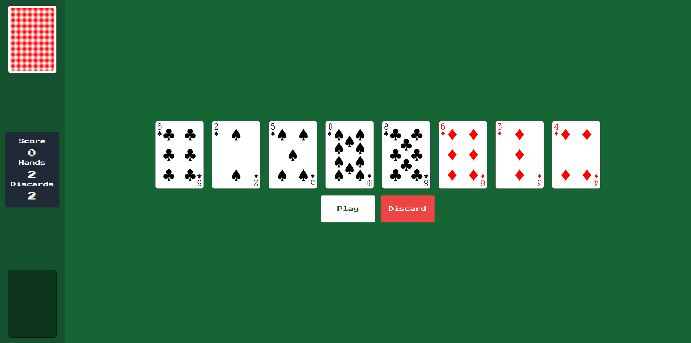

# Poker Game

A simple and interactive Poker game built with React, TypeScript, Tailwind CSS, and bootstrapped with Vite.

## Demo



## Table of Contents

- [Demo](#demo)
- [Installation](#installation)
- [Usage](#usage)
- [License](#license)

## Installation

1. Clone the repository:
    ```sh
    git clone https://github.com/donniebeck/poker-game.git
    cd poker-game
    ```
2. Install dependencies using `pnpm`:
    ```sh
    pnpm install
    ```

## Usage

Start the development server:
```sh
pnpm run dev
```

## License

This project is licensed under the MIT License.
